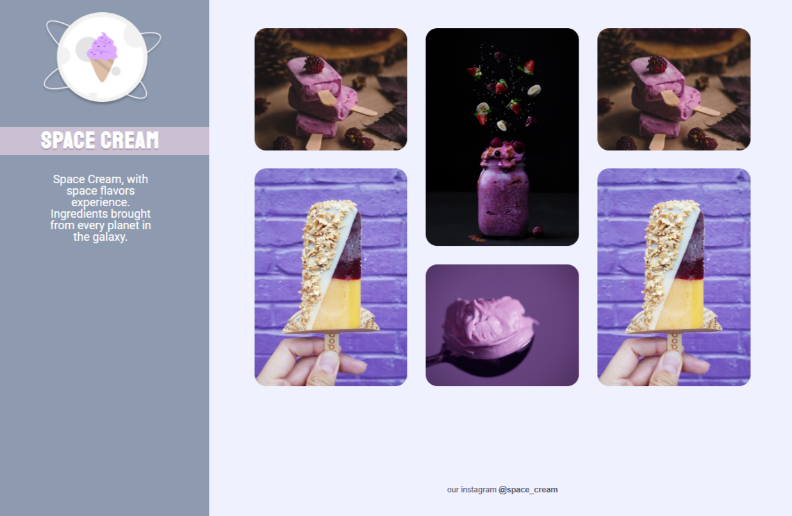

<h2>Space Cream | Galaxy</h2>

  

  
<h2>Description</h2>

<a href="https://www.rocketseat.com.br/">Rocketseat</a> explorer Acceleration Program Level 6 Challenge. 

<ul>
  <li>Very challenging project. I had a lot of fun doing the project.</li>
  <li>Project made with HTML5 and CSS3</li>
  <!--<li><a href="https://efficient-sloth-d85.notion.site/Desafio-Pricing-Table-e0b6f59253e54d229fdde09228226b32" target="_blank">Link para o Desafio</a></li>-->
  <li>Responsive Page</li>
  <li>Grid Concepts</li>
  <li>Animations and Transitions Concepts</li>
  <li>Media Queries</li>
  <!--<li>Plugin <a href="https://scrollrevealjs.org/">ScrollReveal</a> utilizado</li>-->
</ul>

<h2>Stacks</h2>

 
  
  
  
  <!---->
  
  <!--
  -->
  
  

<h2>Contacts</h2>

    
    
     
     

